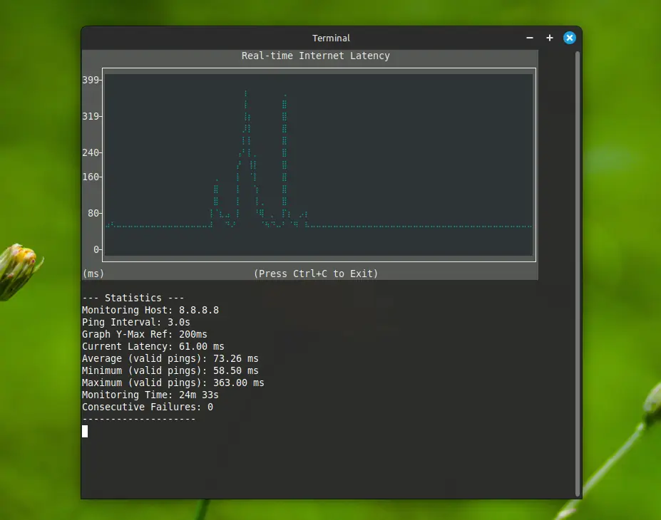

# Real-time Network Latency Monitor

A Python command-line tool to monitor and graph your internet connection latency in real-time directly in the terminal. This tool is designed for Linux systems.



## Overview

This script provides a continuously updating text-based graph of network ping latency to a specified host. It also displays key statistics such as current, average, minimum, and maximum latency, total monitoring time, and a count of consecutive ping failures. Failures are clearly marked on the graph.

The tool is configurable via command-line arguments for the target host, ping interval, Y-axis maximum reference, and the number of Y-axis ticks.

## Features

* **Real-time Latency Graph:** Displays a scrolling graph of ping times directly in your terminal using `plotext`.
* **System Ping Utility:** Leverages the native `ping` command of your Linux system.
* **Configurable Parameters:**
    * Target host or IP address.
    * Interval between pings (in seconds).
    * Reference maximum for the Y-axis of the graph (in ms).
    * Approximate number of ticks on the Y-axis.
* **Failure Indication:** Ping failures are visually distinguished on the graph with red 'X' markers at the base (0ms line), while the main data line shows 0ms for these points to maintain Y-axis scaling.
* **Key Statistics:** Shows current latency, average of valid pings, minimum and maximum valid pings, total monitoring duration, and current consecutive ping failures.
* **Environment Setup Script:** Includes a `run_monitor.sh` script to automatically create a Python virtual environment and install dependencies.
* **Linux Focused:** Optimized for Linux environments.
* **User-Friendly Display:** Uses ANSI escape codes for a smoother, non-flickering display update and hides the cursor during operation.

## Requirements

* Linux operating system.
* Python 3.6 or newer.
* The `ping` utility must be installed and accessible in your system's PATH.
* Python dependencies (which will be automatically installed by `run_monitor.sh`):
    * `plotext` (for creating graphs in the terminal)
    * `argparse` (standard library, for command-line argument parsing)

## Setup Instructions

1.  **Clone the Repository (or Download Files):**
    If you have Git installed, clone the repository:
    ```bash
    git clone https://github.com/galvani4987/monitor_net.git
    cd monitor_net
    ```
    Alternatively, download the files (`monitor_net.py`, `run_monitor.sh`, `requirements.txt`) into a directory on your system.

2.  **Navigate to the Project Directory:**
    Open your terminal and change to the directory where you cloned or downloaded the files.
    ```bash
    cd path/to/monitor_net
    ```

3.  **Make the `run_monitor.sh` Script Executable:**
    This step is crucial for running the setup and application script.
    ```bash
    chmod +x run_monitor.sh
    ```

## How to Use

The `run_monitor.sh` script is the recommended way to start the latency monitor. It performs the following actions:
* Checks for Python 3.
* Creates a Python virtual environment named `.venv_monitor_net` within the project directory (if it doesn't already exist).
* Activates the virtual environment and installs (or updates) the Python dependencies listed in `requirements.txt` (currently `plotext`).
* Executes the main `monitor_net.py` script with any provided arguments.

**Running with Default Settings:**
To start monitoring with the default settings (pinging `8.8.8.8` every `3` seconds, graph Y-axis reference up to `200ms`, and `6` Y-axis ticks):
```bash
./run_monitor.sh
```

**Using Command-Line Arguments:**
You can customize the behavior by passing arguments to `run_monitor.sh`. These arguments are then forwarded to the `monitor_net.py` script.

**Syntax:**
```./run_monitor.sh [host] [-i INTERVAL] [--ymax YMAX] [--yticks YTICKS]```

**Available Arguments:**

* `host`: (Positional, Optional) The host or IP address you want to ping.
    * Default: `8.8.8.8`
* `-i INTERVAL`, `--interval INTERVAL`: (Optional) The time in seconds between each ping. Accepts float values (e.g., 0.5).
    * Default: `3.0` seconds
* `--ymax YMAX`: (Optional) Sets the reference maximum value for the Y-axis of the graph, in milliseconds. The graph will display at least up to this value but will auto-expand if latency spikes exceed it.
    * Default: `200.0` ms
* `--yticks YTICKS`: (Optional) Specifies the desired approximate number of discrete tick marks (and their labels) to display on the Y-axis.
    * Default: `6`

**Examples:**

* Monitor the host `1.1.1.1` with a ping interval of 1.5 seconds:
    ```bash
    ./run_monitor.sh 1.1.1.1 --interval 1.5
    ```

* Monitor the default host (`8.8.8.8`) with a Y-axis reference up to 100ms and 5 Y-axis ticks:
    ```bash
    ./run_monitor.sh --ymax 100 --yticks 5
    ```

* Monitor `my.local.gateway` every 0.5 seconds:
    ```bash
    ./run_monitor.sh my.local.gateway -i 0.5
    ```

**Stopping the Monitor:**
To stop the script, press `Ctrl+C` in the terminal where it is running.

## Files in the Project

* `monitor_net.py`: The main Python script containing the monitoring and plotting logic.
* `run_monitor.sh`: A shell script that automates the setup of the Python virtual environment, installation of dependencies, and execution of `monitor_net.py`.
* `requirements.txt`: A file listing the Python package dependencies (currently just `plotext`).
* `README.md`: This file, providing documentation for the project.
* `.gitignore`: Specifies intentionally untracked files that Git should ignore.
* `screenshot*.*`: Example screenshots of the monitor in action.

## Troubleshooting

* **`CRITICAL ERROR: 'ping' command not found...`**: Ensure the `ping` utility is installed on your Linux system and is in your system's PATH. It's usually part of a package like `iputils-ping` or similar.
* **Graph not displaying well / `WARNING: Calculated plot area is too small...`**: Try increasing the height and width of your terminal window. The script attempts to adapt, but very small terminal sizes can limit graph rendering.
* **Other Python errors**: Ensure you have Python 3.6+ installed. The `run_monitor.sh` script attempts to use `python3`.

## Contributing

This is a small personal project, but if you have suggestions or improvements:
1.  Fork the repository.
2.  Create a new branch for your feature or bug fix.
3.  Make your changes.
4.  Submit a pull request with a clear description of your changes.
